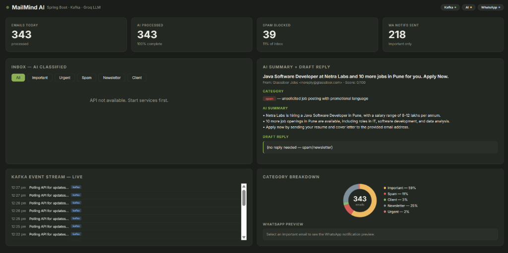
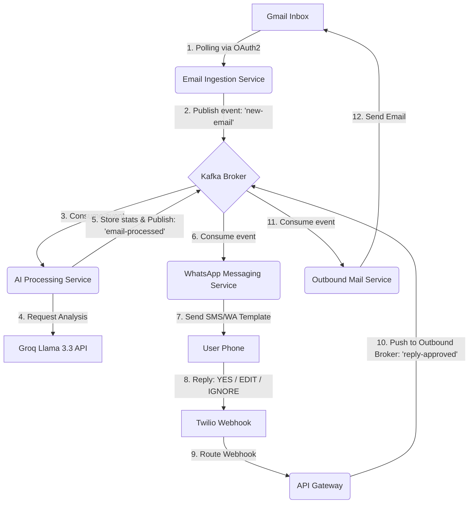

# ⚡ MailPulseAI — Event-Driven, Distributed AI Email Assistant

[](https://spring.io/projects/spring-boot)
[](https://kafka.apache.org/)
[](https://groq.com/)
[](https://www.twilio.com/)
[](https://www.docker.com/)

**MailPulseAI** is a production-grade, event-driven microservices ecosystem that automates your email workflows using state-of-the-art Large Language Models (LLMs). It polls your inbox, classifies and summarizes emails in real-time, pushes notifications to your WhatsApp, and lets you send context-aware drafts back to recipients—all with a single message response.

---

## 🖥️ Live Dashboard Preview

Below is a snapshot of the dark-mode real-time analytics dashboard monitoring the mail pipeline:



---

## 🌟 Key Features

- 📨 **OAuth 2.0 Gmail Poller**: Secure, automated inbox ingestion that tracks unread emails.
- 🧠 **Groq-Powered LLM Pipeline**: Instant categorization (Urgent, Important, Client, Newsletter, Spam) and extraction of action items using Llama 3.3.
- 💬 **Interactive WhatsApp Control**: Receive summary cards on your phone and reply with simple text triggers:
  - `YES`: Send the AI-crafted response draft.
  - `EDIT: <your custom text>`: Customize the reply text before sending.
  - `IGNORE`: Dismiss the email.
- 📊 **Real-time Monitoring**: Real-time event logging, metrics, Kafka event stream, and category distribution charts on a sleek glassmorphic dashboard.
- 🏗️ **Robust Microservices Architecture**: Built on Spring Boot, Apache Kafka, Redis, Eureka Discovery Server, and Spring Cloud Gateway.

---

## 🏗️ Architecture Flow



---

## 🛠️ Microservices Ecosystem

| Service | Port | Description |
|---------|------|-------------|
| **Eureka Server** | `8761` | Service Registry & Discovery Server |
| **API Gateway** | `8080` | Unified Entrypoint, Webhook Gateway & Static Dashboard Server |
| **Email Ingestion Service** | `8081` | Periodically polls Gmail Inbox, saves messages, and publishes events |
| **AI Processing Service** | `8082` | Connects to Groq/LLM APIs, categorizes mail, and builds drafts |
| **WhatsApp Service** | `8083` | Handles Twilio integration, notifications, and incoming reply webhooks |
| **Outbound Mail Service** | `8084` | Sends out approved replies using Gmail API |

---

## ⚙️ Prerequisites (All Free)

- **Docker Desktop** (docker.com)
- **Java 21 (JDK)** & **Maven 3.9+**
- **Groq API Key** (console.groq.com)
- **Google Cloud Platform Project** (with Gmail API enabled)
- **Twilio Sandbox Account** (twilio.com)
- **ngrok** (for local webhook tunneling)

---

## 🚀 Step-by-Step Setup Guide

### Step 1 — Get Your Groq API Key
1. Register at [console.groq.com](https://console.groq.com).
2. Navigate to **API Keys** ➔ **Create API Key**.
3. Copy your token (starts with `gsk_...`).

### Step 2 — Configure Gmail OAuth 2.0
1. Create a project at [Google Cloud Console](https://console.cloud.google.com).
2. Enable the **Gmail API** in APIs & Services.
3. Configure the OAuth Consent Screen as **External** and add your Gmail as a test user. Include scopes: `gmail.readonly` and `gmail.send`.
4. Create **Credentials** ➔ **OAuth Client ID** (Desktop Application) and download the JSON.
5. Generate a refresh token by running the helper script:
   ```bash
   pip install google-auth-oauthlib
   export GOOGLE_CLIENT_ID=your-client-id
   export GOOGLE_CLIENT_SECRET=your-client-secret
   python scripts/get_refresh_token.py
   ```
6. Complete the login flow in the browser and copy the printed `GOOGLE_REFRESH_TOKEN`.

### Step 3 — Set Up Twilio WhatsApp Sandbox
1. Create an account at [Twilio](https://www.twilio.com).
2. Grab your **Account SID** and **Auth Token** from the dashboard.
3. Activate the Sandbox under **Messaging** ➔ **Try it out** ➔ **Send a WhatsApp message**.
4. Join the sandbox using the instructions provided (sending `join <sandbox-code>` to `+1 415 523 8886`).

### Step 4 — Set Up Your Environment Variables
Copy `.env.example` to `.env` and fill in all variables:
```bash
cp .env.example .env
```
Ensure all variables are populated:
```env
GROQ_API_KEY=gsk_...

GOOGLE_CLIENT_ID=your_client_id.apps.googleusercontent.com
GOOGLE_CLIENT_SECRET=your_client_secret
GOOGLE_REFRESH_TOKEN=your_refresh_token

TWILIO_ACCOUNT_SID=AC...
TWILIO_AUTH_TOKEN=your_auth_token
TWILIO_WHATSAPP_FROM=whatsapp:+14155238886
WHATSAPP_TO=whatsapp:+91XXXXXXXXXX

# Infrastructure settings (used by docker-compose)
KAFKA_BOOTSTRAP_SERVERS=kafka:9092
SPRING_DATASOURCE_URL=jdbc:postgresql://postgres:5432/mailpulseai
SPRING_DATASOURCE_USERNAME=mailpulseai
SPRING_DATASOURCE_PASSWORD=mailpulseai_secret
SPRING_REDIS_HOST=redis
SPRING_REDIS_PORT=6379
EUREKA_CLIENT_SERVICEURL_DEFAULTZONE=http://eureka-server:8761/eureka/
```

> [!WARNING]
> Never commit your `.env` file to version control. The `.gitignore` is pre-configured to exclude it.

---

## 🐋 Running via Docker Compose

Building and launching the entire stack is single-command automated:

```bash
# Build and run containers in background
docker compose up --build -d

# Watch active microservice logs
docker compose logs -f
```

### Verification Endpoints

Give the services around 90 seconds to register with Eureka, then verify:
- **Service Registry**: Open `http://localhost:8761` to see all 5 microservices registered.
- **Kafka Dashboard (UI)**: Access `http://localhost:8090` to view active topics (`new-email`, `email-processed`, `reply-approved`).
- **Dashboard UI**: Visit `http://localhost:8080` to interact with the visual dashboard.
- **API Status**: Run `curl http://localhost:8080/api/ai/emails/stats` to verify data metrics.

---

## 🛜 Connect the Webhook (ngrok)

To receive WhatsApp replies in your local environment, Twilio needs a public route to forward events to.

1. Open ngrok to expose your API Gateway:
   ```bash
   ngrok http 8080
   ```
2. Copy the generated HTTPS forwarding URL (e.g. `https://your-tunnel.ngrok-free.app`).
3. Set your Twilio sandbox settings webhook webhook url to:
   `https://your-tunnel.ngrok-free.app/webhook/whatsapp`
4. Make sure the method is set to **POST**.

---

## 📬 WhatsApp Commands Reference

When an email arrives, you'll receive a structured summary on your phone. Respond directly with:

| Command | Action |
|---|---|
| `YES` | Approves and sends the AI-generated draft response back to the sender. |
| `EDIT: <your custom response>` | Sends your custom response instead of the AI draft. |
| `IGNORE` | Skips processing and leaves the email untouched. |

---

## 💸 Running Costs Overview

| Component | Sandbox / Free Tier Limits | Cost |
|---|---|---|
| **Oracle Cloud** | 1 ARM VM (4 OCPUs, 24 GB RAM) | **$0 / month** |
| **Groq AI (Llama 3.3)** | 30 RPM, 1000 RPD | **$0 / month** |
| **Twilio WhatsApp** | Free sandbox / $15 trial credit | **~$0.005 / msg** |
| **Upstash Kafka** | 10,000 free messages / day | **$0 / month** |
| **Gmail API** | Generous free usage limits | **$0 / month** |

For personal day-to-day email management, the total monthly cost is **effectively $0**.

---

*MailPulseAI — Reimagining email management with event-driven AI pipelines.*  
*All rights reserved.*
